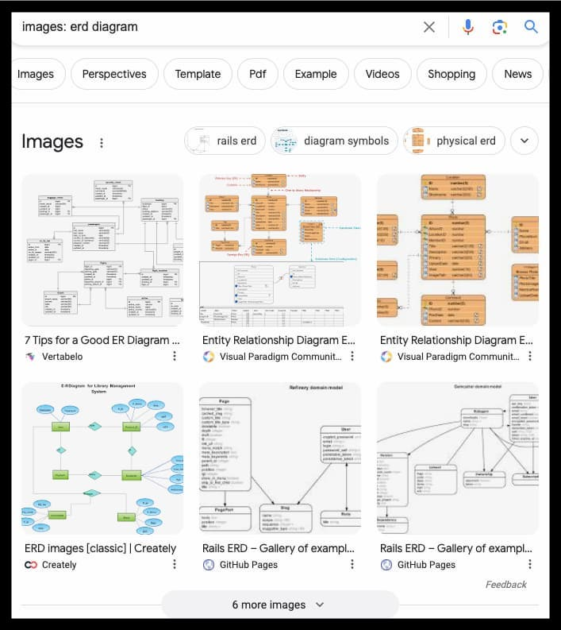
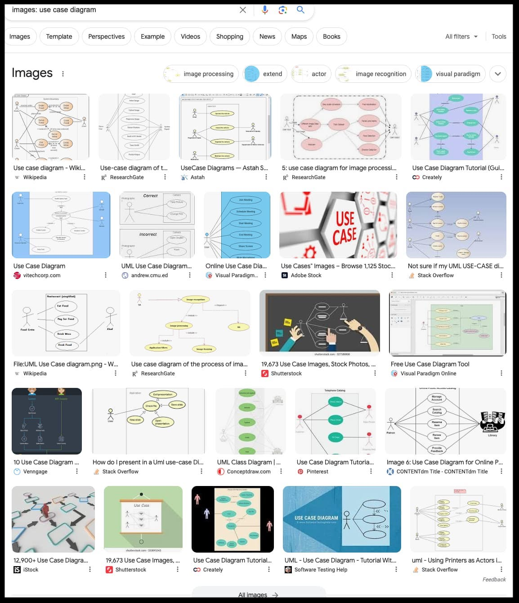
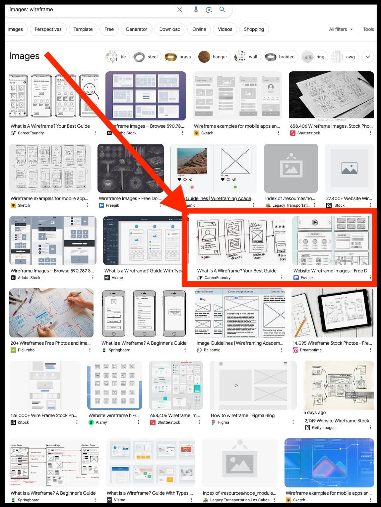
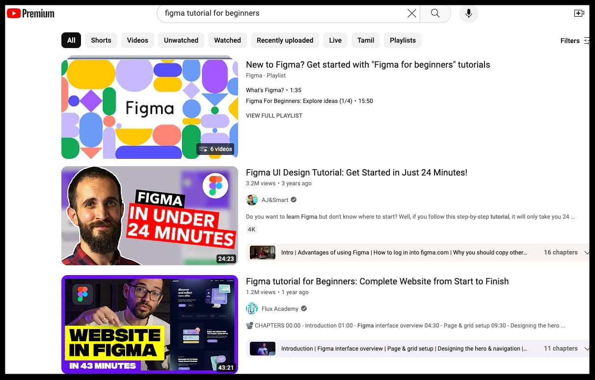
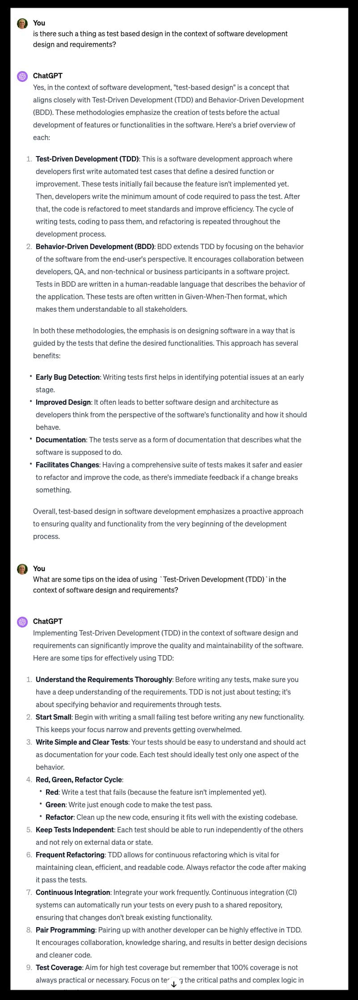

# FAQ for Design & Requirements Documentation

## Glossary

Terms `issue`, `ticket`, `task`, and `PR` or `Pull Request` may be used interchangeably, within this document.

## TL;DR

If you only want the basics:

- [Over-riding principle](#what-is-our-over-riding-principle-in-springwise-design--documentation)
- [Modified CRUD](#modified-crud-is-the-simple-explanation)
- [When is Modified CRUD not practical within Springwise?](#when-is-modified-crud-not-practical-within-springwise)

## Documentation on More Typical Design Requirements

Consult these as references:

1. [ERD or Entity Relationship Diagram](#when-to-use-an-erd-or-entity-relationship-diagram)
2. [Use Case Diagram](#when-to-use-a-use-case-diagram)
2. [Wireframe](#wireframe)
2. [Figma or Illustrator](#figma-for-high-resolution-prototypes)
2. [Test Driven Development (TDD)](#tdd)

---

## What is our over-riding principle in Springwise Design & Documentation?

### Primary Constraint
LiveCoding constraints include:
- Short bursts of effort
- Untrained participants (in design docs).
- Shallow understanding of tools/processes.
- A focus on small, incremental successes.

Given these constraints, we attempt to create our design docs with _**extreme simplicity**_ in mind. More is usually less, in this context.

### Compensating Strategy

1. Issues or tickets should be very small in scope.
2. The most straightforward tool that works is the best tool.
3. Complex designs need to be converted into markdown docs to spawn subsequent issues/tickets.

Notice that this "simple" strategy is already too complex. WUT? Markdown?

### Corporate vs Bootcamp

- Ambiguity is a curse in the corporate world. Follow instructions, period.
- A bootcamp environment is the exact opposite. Learning is the primary objective.

[back](#tldr)

## Modified CRUD is the simple explanation

Our primary form of Design & Requirements is `Modified CRUD`

1. We start with whatever CRUD design we do, or could have.
2. Modify that for some simple fix, or feature.

**Example:**
`String foo` becomes `boolean foo` in the table design, and then we make it a checkbox in the `create.html` view. 

**Anti-Pattern:** Proper agile requirements might make this into a user story, and create ERD or UML to document the change, then provide for a careful design doc of the test cases and or other proper documents as shown below. We would do _**none**_ of that, if avoidable.

[back](#tldr)

## When is Modified CRUD not practical within Springwise?

Even if rarely - sometimes we need to use more traditional design tools and processes.

But how to know?

The shorter answer is - _"... when our normal process isn't working."_ 

Consult documenation types below - to learn about some of the more traditional tools and processes for design docs.

## When to use an ERD or Entity Relationship Diagram?

In case you've never seen this before, you could always google `images: erd diagram` and get something like this. 

Picture is worth a thousand words. 

In this case, think database schema of Assignment 12. The time when you want to use this is when the tables are already created and functional, and you want to use a tool like MySQL Workbench to reverse engineer into an ERD and allow you to document that part of the design visually.

[back](#tldr)

## When to use a use case diagram?

In case you've never seen these types of docs before, you could always google `images: use case diagram` and get something like below - a picture is worth a thousand words etc. 

As you can see at quick glance there is no single approach or formula but they all tend to follow a similar flow. 

The most obvious time when we would want to use this to define requirements is when the verbal or words version of an interaction becomes so crazy and difficult that a it would be just easier to show it in a diagram. If it's starting to feel more like `Word Salad` than just `words` maybe one or more use case diagrams would be a better alternative.

We have a number of such situations in Springwise, such as when David Roberts outlines a hard to follow or long winded process for setting up one's LinkedIn for success.

Another situation when it would be easier to use a use case diagram would be when there are multiple types of interactions with one table, each very different. Such as user experience data being a part of turn taking calculations, then much later for building statistics of work completed during LiveCoding sessions. Lotta words.

One last thing: Don't get hung up on tooling, here. There are a huge number of free and/or paid tools available for sketchy stuff like you see below. Perfection is the enemy of good. Just pick one and go with it, export the results to a file and post it in a markdown document such as this one.

[back](#documentation-on-more-typical-design-requirements)

# Wireframe

I'm big on the "paper napkin" approach where two people sitting down with beers and sketching out the main parts of a UI view in a few minutes, and often that is good enough to really dive into the details of a UI.

But there are tons of approaches to wireframe, such as this quick google of `images: wireframe` shows.

Notice the cruder parts below. Quite often, that's great!

But you can even use more advance tools like Figma, by just ignoring their better capabilities that you don't yet need. 

If you want to take wireframes too seriously, there are lots of great tools out there to help you do wireframes. I don't recommend them for Springwise types of teams, but they can be great in the corporate world.

Here is a youtube for executing wireframe with Figma

https://www.youtube.com/watch?v=D4NyQ5iOMF0

[back](#documentation-on-more-typical-design-requirements)

# Figma for High Resolution Prototypes

In order for you to understand this next section, you HAVE to first understand that corporations might often spend a million or millions of dollars on totally non-functional design - Yup! Just how every view in an app looks. Entire teams do nothing but UI prototyping for months or even years.

What is a prototype, in this context? It is _**a picture**_ of what that page of the app would look like, after it is developed. 

What does the developer do, then? She/he uses the Figma or other representation as an exact visual model, and matches the actual app, to the protoype. 

To learn more about how to use Figma to paint such a picture ...

Note: Figma is shown here but much of the industry would use Adobe Illustrator or other excellent tools. Figma is more useful to us because of it's wide usage and excellent free tier.

[back](#documentation-on-more-typical-design-requirements)

## TDD

This is a thing. No, really. You define an issue by the tests that it must pass :)

[back](#documentation-on-more-typical-design-requirements)

